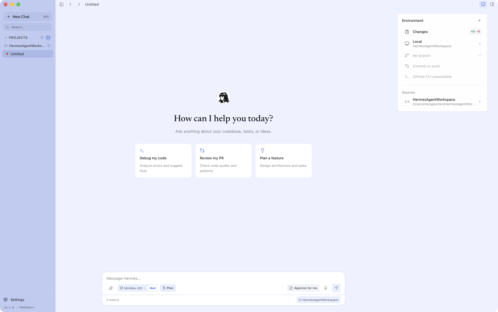

<div align="center">


# Hermes Studio

A desktop-first fork of [Hermes Agent](https://github.com/NousResearch/hermes-agent), bringing the agent runtime into a native desktop workbench.

[](LICENSE) [](https://github.com/NousResearch/hermes-agent) [](apps/hermes-studio/docs/RELEASE.md) [](https://www.electronjs.org/) [](https://www.solidjs.com) [](https://www.python.org)

</div>

---

Hermes Studio keeps the upstream Hermes agent foundation — providers, models,
skills, tools, memory, sessions, and config — and wraps it in a native desktop
workspace built with **Electron**, **SolidJS**, **TypeScript**, and a **Python
sidecar**.

The goal is to make Hermes feel like a local workbench for software tasks:
project-aware conversations, model and profile controls, tool activity,
approvals, workspace status, and a native desktop shell around the agent
runtime.

<div align="center">



</div>

## ✨ What This Fork Adds

| | |
| :-- | :-- |
| 🖥️ **Native desktop app** | An Electron shell with custom window chrome, sidebar navigation, prompt composer, right-side environment panel, and desktop packaging targets. |
| 🐍 **Desktop-owned sidecar** | A Python daemon under `apps/hermes-studio/sidecar` exposes the local API surface used by the frontend and keeps desktop concerns out of the core agent loop. |
| 💬 **Workspace-first chat** | Conversations organized around local projects, git/workspace state, prompt planning controls, tool output, and approval flows. |
| 🔌 **Hermes core compatibility** | Continues to use the upstream agent concepts: providers, models, skills, tools, memory, sessions, and config. |
| 🧩 **Open development surface** | Hermes Studio lives in `apps/hermes-studio/` and can be run, tested, and packaged independently from the upstream CLI and gateway surfaces. |

## 🚀 Quick Start

> **Platform packaging:** Hermes Studio has host-native targets for macOS,
> Windows, and Linux. Build each target on its matching operating system and
> complete the packaged smoke and native acceptance gates in
> [the release guide](apps/hermes-studio/docs/RELEASE.md) before publication.

**Prerequisites**

- A macOS, Windows, or Linux host for its matching package target
- Node.js
- `uv` and Python 3.11 for the sidecar environment

**Run in development mode**

```bash
cd apps/hermes-studio
npm install
npm run dev
```

In development, Vite serves the frontend on `http://localhost:1420` and the
desktop sidecar uses port `18080`.

## 🛠️ Useful Commands

Run these from `apps/hermes-studio/`:

| Command | Description |
| :-- | :-- |
| `npm run dev` | Start the Vite frontend and Electron shell |
| `npm run backend` | Start the Python sidecar daemon |
| `npm run build` | Build the renderer and Electron processes |
| `npm run pack` | Build an unpacked application for local smoke testing |
| `npm run dist` | Build the packaged Electron application |
| `npm run typecheck` | Run renderer and Electron TypeScript checks |
| `npm run lint` | Run ESLint for the renderer and Electron sources |
| `npm run test` | Run Vitest unit tests |
| `npm run test:e2e` | Run Playwright end-to-end tests |
| `npm run docs:check` | Validate canonical documentation, links, and commands |

## 📁 Repository Layout

| Path | Purpose |
| :-- | :-- |
| `apps/hermes-studio/` | Hermes Studio: Electron shell, SolidJS frontend, sidecar daemon, tests, and design docs |
| `apps/hermes-studio/src` | Studio frontend features, stores, shell layout, services, and UI primitives |
| `apps/hermes-studio/sidecar` | Python daemon used by Hermes Studio |
| `run_agent.py`, `model_tools.py`, `toolsets.py` | Upstream Hermes agent runtime surfaces retained by this fork |
| `skills/`, `plugins/`, `tools/` | Hermes extension surfaces inherited from upstream |

For Studio-specific architecture notes, see
[apps/hermes-studio/README.md](apps/hermes-studio/README.md),
[apps/hermes-studio/DESIGN.md](apps/hermes-studio/DESIGN.md), and
[ADR-001](apps/hermes-studio/docs/decisions/ADR-001-electron-shell.md).

## 🔗 Relationship to Upstream Hermes Agent

This project is based on the open-source Hermes Agent codebase from
[Nous Research](https://github.com/NousResearch/hermes-agent). Upstream Hermes
provides the agent core, CLI, TUI, messaging gateway, tooling, skills, memory,
provider integrations, and scheduling foundations.

This fork focuses on the Hermes Studio experience in `apps/hermes-studio/`. When working
on the desktop app, prefer extending that surface rather than changing upstream
core behavior — unless the desktop feature genuinely requires a shared runtime
change.

## 📝 Development Notes

- Keep desktop UI state and Hermes runtime configuration separate.
- Prefer small, feature-owned frontend stores over passing state through many
  layers.
- Use the existing sidecar and gateway adapter patterns before adding new
  communication paths.
- New model tools should stay out of core unless they are fundamental and
  broadly useful; most extension work belongs in commands, skills, plugins, or
  service-gated tools.

## 🙏 Acknowledgements

- **[Hermes Agent](https://github.com/NousResearch/hermes-agent)** — by [Nous Research](https://nousresearch.com). The agent runtime this fork is built upon.
- **[Codex](https://github.com/openai/codex)** — the macOS seatbelt sandbox mechanism in the desktop sidecar is adapted from the Codex project.

## 📄 License

MIT. See [LICENSE](LICENSE).
